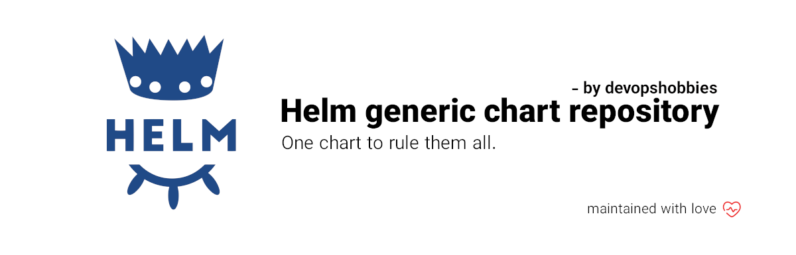

# Devopshobbies helm generic chart

This chart is created to be used inside devopshobbies & kaiser-io devops operations.

## How it works:

The use-case is pretty simple and you can start using this by fetching the chart. Also there is one values.example.yaml defined for you witch you can check and have a look to find out how to set the variables.
